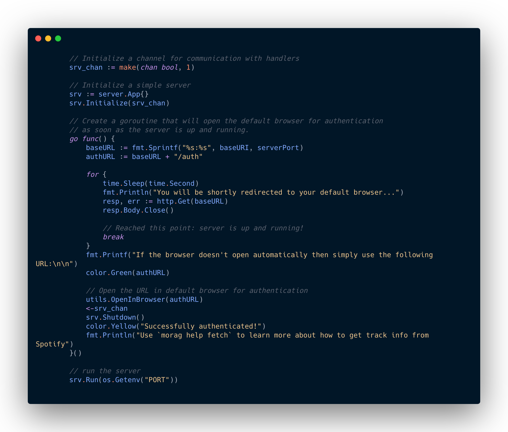

Morag
======
[](https://goreportcard.com/report/github.com/shashankgroovy/morag)
[](https://github.com/shashankgroovy/morag/blob/master/LICENSE)


A small command-line tool written in Go that let's you fetch the entire
catalogue/library of artists from Spotify.

It is supercharged with the help of [Cobra](https://github.com/spf13/cobra) and
implements OAuth2 for authentication.

Requirements
------------
* Go version v1.12

Getting Started
---------------

Run Morag by issuing the following commands:

```
λ go build
```

Useful help text is also available when the command is used alone.

```
λ ./morag
Morag lets your download the entire catalog/library of an artist
from Spotify and saves it to a csv file. It uses OAuth2 for authentication.

Issue the login command to start fetching data from Spotify

Usage:
  morag [flags]
  morag [command]

Available Commands:
  fetch       Fetches track information for an artist.
  help        Help about any command
  login       Login connects you to your Spotify account.
  logout      Logs out a current user.

Flags:
      --config string   config file (default is $HOME/.morag.yaml)
  -h, --help            help for morag
  -t, --toggle          Help message for toggle

Use "morag [command] --help" for more information about a command.
```

Morag spawns a mini-server to implement the OAuth2 handshake. To fascilitate
that you need to create a small non-commercial app on Spotify.

- Head over to [Spotify Dashboard](https://developer.spotify.com/dashboard) and create an application.
- Export the `client_id` and `client_secret` as environment variables

Then, run the following command to initiate the authentication process:
```
λ ./morag login
```
Here's a sneak peak as to how it's done.


> Note:
> To load environment variables if you're a terminal girl/guy, you might want
> to use [direnv](https://direnv.net/). Simply, make the variables present in
> `.env.example` available.

## Credits
In reference to the following conversation:

> "Quill said he stole the [Power Stone](https://marvelcinematicuniverse.fandom.com/wiki/Power_Stone) from Morag."
>
> "Is that a person?"
>
> "No, Quill's a person. Morag's a planet."
>
> ― Rocket Raccoon and War Machine

[Morag](https://marvelcinematicuniverse.fandom.com/wiki/Morag) is an oceanic planet located in the Andromeda Galaxy at the Eclipsing Binary Star M31V J00443799+4129236. © Marvel.

## Contribution
Well this is kind of a learning project, feel free to fork it and happy hacking :)

## License
[MIT License](http://mit-license.org/)

Copyright © 2019 Shashank Srivastav
